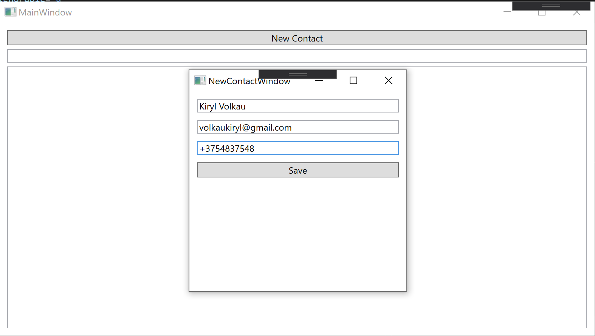
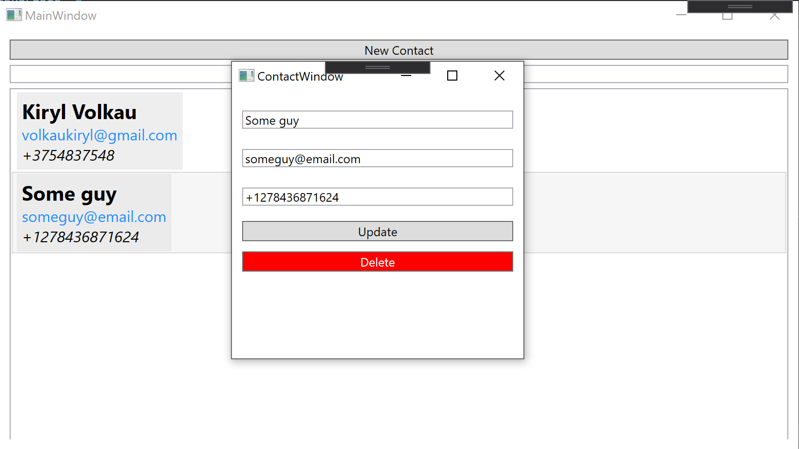

# Contacts app - WPF
### Technologies used :
1. C#, WPF
   1. Data binding
   2. Custom controls
   3. ListView
2. SQLite

### What is it?
Simple contacts app, allowing you to create, update, delete, filter and display contacts. It uses local `contacts.db` SQLite database, stored in *Documents* folder.

### Workflow
On the initialization this app displays all contacts from database on the main window. When you click `Add contact` button it show you dialog window for creating a contact and right after you click `Save` button this contact is stored and displayed in the database. When you select this contact from a list on the main page you can modify it and then click `Update` or `Delete`. In both situations changes will be displayed and stored immediately.  
Also, on the main page you can see `TextBox`, allowing you to search for the contact by its name. Conacts are ordered in descending order by `Name` property.

### Screenshots

